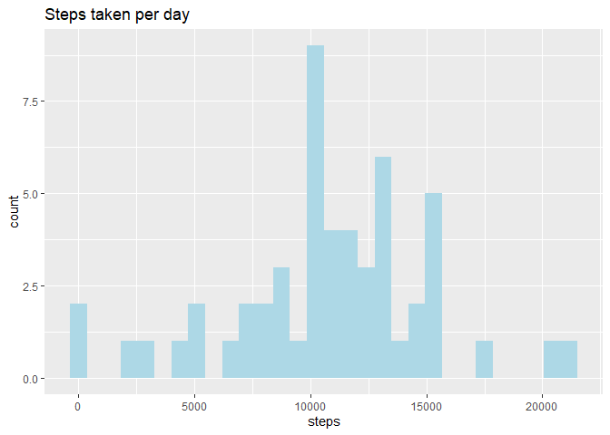

## Loading and preprocessing the data

```r
unzip("activity.zip", exdir = "temp_data")
activity <- read.csv("temp_data/activity.csv") %>%
        mutate(date = as.Date(date, "%Y-%m-%d"))
unlink("temp_data", recursive = TRUE)
```


## What is mean total number of steps taken per day?

```r
totalSteps <- 
    activity %>% 
    group_by(date) %>%
    summarise(steps = sum(steps))

meanDay <- mean(totalSteps$steps, na.rm = T)
medianDay <- median(totalSteps$steps, na.rm = T)
```


```r
ggplot(data = totalSteps, aes(steps)) +
    geom_histogram(fill = "lightblue") +
    labs(title = "Steps taken per day")
```

<!-- -->

The mean and median of the total number of steps taken per day are 
10766.19 and 10765 respectively.

## What is the average daily activity pattern?


```r
averageSteps <-
    activity %>% 
    group_by(interval) %>%
    summarise(steps = mean(steps, na.rm = TRUE))

maxInt <- averageSteps$interval[which.max(averageSteps$steps)]

ggplot(averageSteps, aes(x=interval, y=steps)) +
    geom_line(color = "lightblue", size = 1) +
    labs(title = "Average daily activity pattern")
```

<!-- -->

The interval 835 contains the maximum number of steps on average across all the days in the dataset.

## Imputing missing values


```r
totalNa <- sum(is.na(activity$steps))
activityFull <- data.frame(activity) 

for (i in which(is.na(activity$steps))) {
    activityFull$steps[i] <- 
        averageSteps$steps[which(averageSteps$interval == activityFull$interval[i])]
}
```

In the dataset are a total of 2304 rows with missing values.


```r
totalStepsFull <- 
    activityFull %>% 
    group_by(date) %>%
    summarise(steps = sum(steps))

meanDayFull <- mean(totalStepsFull$steps, na.rm = T)
medianDayFull <- median(totalStepsFull$steps, na.rm = T)
```


```r
ggplot(data = totalStepsFull, aes(steps)) +
    geom_histogram(fill = "lightblue") +
    labs(title = "Steps taken per day with NA prediction")
```

<!-- -->

The mean and median of the total number of steps taken per day are 
10766.19 and 10766.19 respectively.

Values differ from the estimates from the first part of the assignment in the middle of the steps. The NA values makes a great difference between both results.


## Are there differences in activity patterns between weekdays and weekends?


```r
weekendT <- c("Saturday", "Sunday")
activityFull$wday <- factor(weekdays(activityFull$date) %in% weekendT,
                            levels = c(F,T),
                            labels = c("weekday", "weekend"))

averageStepsFull <-  
    activityFull %>%
    group_by(wday, interval) %>%
    summarise(steps = mean(steps))
```


```r
ggplot(averageStepsFull, aes(x=interval, y=steps, color=wday)) +
    geom_line(size = 1) +
    facet_grid(wday ~ .) +
    labs(title = "Average daily activity pattern by type of day")
```

<!-- -->


